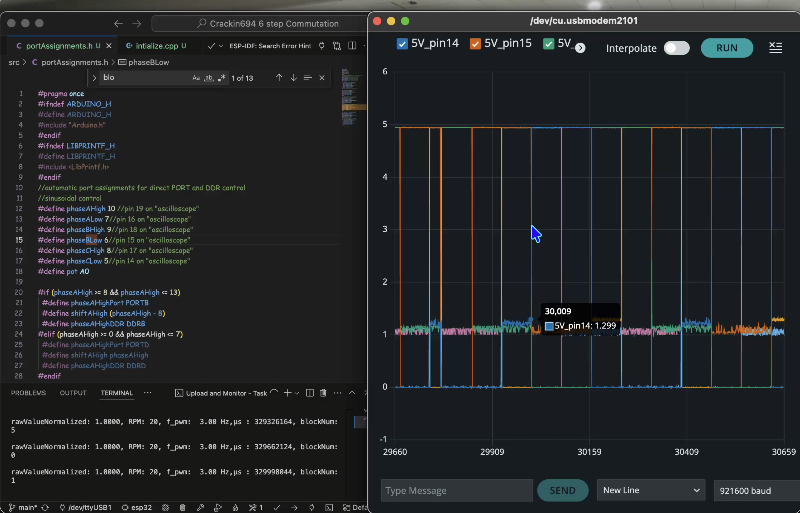

# Kraken x694 BLDC Motor Project :D

Hello! In this repository, I show my process of making my own BLDC Motor project! 
<!-- Other relevant links below:     -->
<!-- >Videos from testing: https://drive.google.com/drive/folders/19Vp0OEzmQrTeg8EhbQTLMmb9ZPl5efjz?usp=sharing -->

# Goal
The Goal of this project is to use as many parts that I have scavenged and lying around to make a functional motor that is looks similar to a Kraken x60 -a popular FIRST Robotics Competition (FRC) motor- enough to confuse anyone at a distance (especially my friends).

### Defining Functional
Nothing crazy complex here
- Free Spins easily when motor is not powered
- Can be software to spin forward and backward (clockwise and counter clockwise)
- motor curve

### Defining "Like" a Kraken x60
Like to a Kraken X60, my motor should
- have the general physcal size should be no more than 1/10 of an inch larger or smaller
- have 12 10-32 motor mounting holes
- have the Blue Kraken x60 mark , with the exception of the number, which wil be 694

- take the same input voltage of a FRC lead acid Batter (12)
- have similar details (like the image shown below):
    - vents on a bottom diagonal slant
    - 4 bolts heads visible from the bottom (thought no protruding)
    - A flat side where the logo is 
    - a sight truncated cone shape

The internal wiring and shape may differ as long as the outer shell requiremetn is still fulfilled.

### Motor Controller/ Electronic Speed Controller (ESC) Constraints

### Other Motor Design Rules/ Constraints
- Use 3d printed pintalement instead of metal wherever possible (due to simplicity and costs)
- fewer than 5  Custom Off the Shelf parts-- prefer desiging own solutions where possible
- No time limit or deadline
- no copying any parts, designs, or schematics for ESC or motor.
    - While some inspiration is allowed, all parts and ocnnections should be made from my own understanding of ESCs and motors.
    - This isn't a real rule, but rather my design philosophy to ensure I fully understand what I'm making.
- having fun yayyy

# Folder Hyperlinks
## [Mechanical](/mechanical/README.md)
Contains explaination for my process in designing the 3D printing physical motor case, stator and rotor, and hwo I assembled it.

## [Electrical](/electrical/README.md)
Contains the files I made along the way to design my Electronic Speed Controller (ESC), from the testing done on Falstad.com (a circuit simulator website) to a breadboard model to my first and second PCB protoypes!

## [Esp32_code](/esp32_code/README.md)
Contains the software I ran on an esp32-d0wd-v3 microcontroller to achieve 6 block commutation (an hopfully 12 block and Field-Oriented Control in the near future), as well as myh process in creating that code

## [Arduino_code](/arduino_code/) & SerialPlotter
Contains Java code I worked on to create a "mini oscilloscope" using arduino or esp32 ADC's. I discontinued this grapher after learining how expand Arduino’s Serial Plotting data by up to 1000 points and labeling the graphs so I can monitor up to 6 channels (one for each analog pin) simultaneously.

<!-- >  
>bldc-falstad_v.txt: text file containing the main circuit design and exported from falstad. I am using falstad.com to simulate my pcb designs. bldc-falstad-v2.txt and bldc-falstad-v1.txt are older versions of my current design.  
>  
>boostConv.txt: up-to-date text file containing the subcircuit design for my boost converter, which will supply the high DC bus voltage for my motor. It is also exported from falstad.com  
>  
>inductanceTest: text file containing the schematic I used to test my motor phases (since my multimeter can't measure inductance, I will be calculating it).  -->

# Acknowledgements

I used a lot of resources, including but not limited to: 
- [Aaron Danner's Transistor playlist](https://www.youtube.com/watch?v=HxfoFFK_zBc&list=PLXb3r5ny8_1X7Ph5vivwAmILwI42OVv94) (to learn AC signal analysis and Transistor configurations)
- MIT's OpenCourseWare
    - 6.002 taught by Anant Agarwal (to learn basic electronics)
    - 6.622 Power Electronics taught by David Perrault (I learned the theory behind Power electronics and buck, boost, and buck boost converters)
- BWSI teaching Assistants (specifically Srikrishna for teaching MOSFET and Semiconductor theory)
- My robotics freinds (shoutout Stuypulse) for being my main motivation
- [Liong Ma](https://www.youtube.com/watch?v=X3_G4lo7YCs) for being an inspiration to start on this adventure
- ChatGPT, which I treated as a search engine to assist me in debugging code, introducing physics, electroncis, and C++ concepts, and most importantly, referring me to external resources that I can trust, like Youtube videos by [Robert Ferranec](https://www.youtube.com/@RobertFeranec) or [Texas Instruments](https://www.youtube.com/@TexasInstruments)
