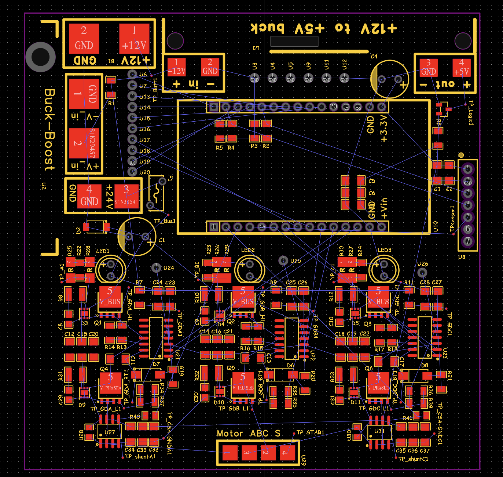
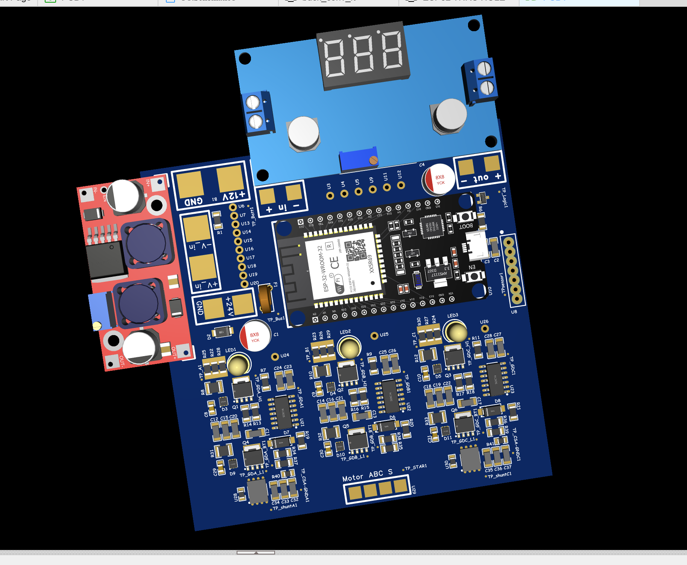

# Designing the Electronic Speed Controller

Up to this point, I was focused only on creating theI knew I needed a motor controller, but spared looking for one until it was finished. However, as I looked online, their prices were rocket high— reliable electric speed Controller ones came at around $30, $40, even $70 dollars for 1! It cost as much as my 3D printed motor I made, and it was even double that of my arduino starter kit! With these price tags, I wanted to get more than a simple motor controller; I should learn something long, lasting, and meaningful that’ll be of service to me in future. It was then I knew I’d make one, one that had much more value than a simple controller.  
Luckily, my electronics journey had already started (around November of 2024). I’d always wanted to learn something new with the starter kit my parents purchased for me. I watched lessons and the playlist series of ELEC 110 and 220, taught by Joe Gryniuk at Lake Washington Technical College, and followed along with the corresponding textbook “Introduction to Electronics“ on train rides and spare time. 

## Breadboard Prototypes
I started by finding values to represent each motor coil in a circuit.  
First, I measured the linear resistance of each inductor using the ohm-meter on my MM450.  

Next, I wanted a good estimate of my motor phase inductances. Despite not having access to an inductance-measuring tool, I eventually figured out a viable formula, using the AC-signal analysis tools I learned from Aaron’s Damer transistors playlist, as well as the node methods from 6.002 lectures by Anant Agarwhal.  

This was the circuit schematic for my voltage AC-source, shown on falstad.com.  

In the DC Darlington model above,  I used ESP32's DAC pins to generate a pseudo-sine wave to mimic an AC signal, which I fed into a Darlington amplifier to create an AC- voltage source. Using definitions and formulas for impedance, I determined an estimate of the phase inductances.  
 

These phases and 20mΩ current sense shunt resistors comprised of my “Motor phases” subcircuit in Falstad.com

 
<!--  -->

## Motor circuit:

My motor controller uses a 3 half-bridge configuration, one half-bridge for each phase. The power bus will be connected to a boost converter, taking the 12V battery input and producing 24V for the gates. Shunt current sense resistors in-line with motor phases are paired with current sense amplifiers to measure the current. Another buck-converter supplied the logic voltage of 5V, which will be used to power the ESP-33. The AS5600 magnetic encoder communicates with the ESP-32 using I2C. To reduce costs, I had asked my robotics coach for permission to bring broken FRC motor controllers home, which I disassembled to salvage PSMN1R0-30YLD enhancement-mode mosfets for my half bridges. 

<!--=========================== COLLAPSIBE SECTION ===========================-->
##

   
 <h3><strong>A failed attempt at creating Boost converter with feedback Control Loop</strong></h1> 

    <!-- NEED BROKEN LINE HERE -->
    I wanted to design my own boost and buck converter module as well, after being inspired from watching MIT’s Open Courseware 6.022 Power electronics series; however, I struggled to implement a feedback system for a stable output voltage.  
    Show below is my basic 555 astable implementation for a boost converter:  
    
     
    My thought process was this: a logic or feedback system could be made either by programming a microcontroller to take input and give output, or it could automatically be regulated by hardware. I didn’t want to use multiple microcontrollers, and I thought creating feedback systems with hardware was more elegant than programming, so I attempted to manipulate the voltage of the CTRL pin on the 555 timer (used in an astable output configuration). the core Integrated chip(IC) that provided the necessary switching logic. I first attempted to look for a mathematical relationship between the duty cycle and the CTRL pin voltage.  
    
    
    
     
    Graphing showed me a direct (almost linear) relationship between the duty cycle and , which I hoped I could utilize through some feedback network.   
    
     
    So, I tried a 2 stage-implementation of my solution. The vertical switch would be closed, and the horizontal one would be open. Stage one has an Op-Amp with unity gain to act as a buffer (switch open in the circuit) so I drew negligible current from the voltage divider (which brought down the voltage to a ratio I hoped to keep constant). Stage 2 compared the output of the buffer to a potentiometer, which I would use to adjust the setpoint voltage.
    
     
    However, it had many problems. Falstad showed that the circuit didn’t work as I predicted: adjustments would often change the 555 switching duty cycle and switching frequency. I spent multiple days attempting to solve this problem, but I realized if I continued, my project’s pacing would be slow. The time I spent on designing motor cases reminded me that I needed to get a prototype soon, and fail fast. So I decided to buy the converters online, and book this sub-project for a future investigation.
    

##
<!--=========================== COLLAPSIBE SECTION ===========================-->

This was my final breadboard prototype circuit schematic. The main difference between this and my intended PCB design was that I made bootstrap circuits for my high-side MOSFET to use instead of the gate drivers that I lacked. I built this circuit, ran it, and was able to reach motor speeds up to 800rpm using 6-step commutation (see video).  

  

[caption: op-amps to represent Current Sense Amplifiers temporarily removed]

<!-- Testing video: [https://drive.google.com/file/d/1aiDmqKBAf_SJHJi-CjGYLPHVinIo39mS/view?usp=sharing](https://drive.google.com/file/d/1aiDmqKBAf_SJHJi-CjGYLPHVinIo39mS/view?usp=sharing)  -->

# Motor Characteristics

From my tests, my motor coils always struggled with generating a magnetic field. I did my share of research, both from my physics regents classes and online searching, and I learned about B = µ₀(N/ℓ)I. I had an air core for my solenoid, and my number of turns and wire length was already determined by my 4oz supply of wire. So, I had to increase my voltage.

After consideration, I decided to use a motor bus voltage of 23-24V maximum, as that would put my phase current at around 1A (if 2 phases were enabled); However, that would only occur when the motor stalls. In normal operation, I would put the motor current to .8A, as I was worried about motor temperature, and that was a safe limit that online sources and ChatGPT had suggested. 57 degrees was the temperature the PLA casing would start degrading or soften.  

## Designing around ESP32

From watching motor control algorithms, such as Field-Oriented Control (FOC) by Texas Instruments and also Janteen Lee’s series on FOC, I learned I needed shunts for phase current sensing. I will use 2 shunts to determine the current of 2 phases, and use Kirchoff's Current Law to determine the third phase current.

While most modern BLDC motors run with 20kHz PWM frequency, I chose to use 16kHz because 1) it was barely within my audio hearing range, and 2) I wanted to use ESP32’s ADC to read the measurements. For my first PCB, I’ve decided to sample with the ADC at 16kHz as well, so that I my measurements are always timed with the gate switching Using 16kHz allows me to attempt higher sampling frequencies in the future, such as 64kHz across 2 channels, totaling to 128kHz, which was about the limit of Espressif’s recommended ESP32 ADC reading speed.

After my circuit was finished, I recreated the schematic on EasyEDA and added more suitable components. While I haven’t wired the traces on the PCB, I have settled on a preferred component placement to minimize inductance and cross-talk across signals on my PCB. Below are the footprints as well as a 3D-model rendition of my current part placement.  
While it is still a work-in progress, I’m excited for its completion!  
  
  
