# Table of Contents
- [Table of Contents](#table-of-contents)
- [Summary of Directories](#summary-of-directories)
- [Resources Used](#resources-used)
- [Introduction](#introduction)
- [Motor Characteristics](#motor-characteristics)
- [Designing the Electronic Speed Controller(s)](#designing-the-electronic-speed-controllers)
  - [ESC V0 (A Breadboard Prototype)](#esc-v0-a-breadboard-prototype)
  - [ESC V1](#esc-v1)
  - [First Time Designing with EasyEDA](#first-time-designing-with-easyeda)
    - [Issues with ESC\_V1](#issues-with-esc_v1)
  - [ESC V2](#esc-v2)

# Summary of Directories
[ESC V0 Falstad Schematics](/electrical/ESC%20V0%20Falstad%20Schematics): stores the breadboard circuits I simulated on Falstad.com and then built 

[ESC V1](/electrical/ESC%20V1/): stores the Gerber file I made of my first version of ESC

[ESC V2](/electrical/ESC%20V2/): stores the Gerber files I made of my second version of ESC. It involves 2 4 layer boards (top one referred to as deck1, bottom one referred to as deck2), stacked together and connected via pin headers. Also contains the Gerber files for my custom MT6701/AS5600 breakout board, compatible with breadboards and has pads for direct wire soldering

[x694_PCB_Schematics](/electrical/x694_PCB_Schematics/): stores the 2d EasyEDA schematics of all the PCBs I made for this project, including:
- ESC V1 (v1 schematics)
- ESC V2 (Deck1, Deck2, MT6701 Breakout)

# Resources Used
- [Aaron Danner's Transistor playlist](https://www.youtube.com/watch?v=HxfoFFK_zBc&list=PLXb3r5ny8_1X7Ph5vivwAmILwI42OVv94) (to learn AC signal analysis and Transistor configurations)
- MIT's OpenCourseWare
    - 6.002 taught by Anant Agarwal (to learn basic electronics)
    - 6.622 Power Electronics taught by David Perrault (I learned the theory behind Power electronics and buck, boost, and buck boost converters)
- [Robert Ferranec](https://www.youtube.com/@RobertFeranec) (PCB Layout, return and displacement currents, decoupling capacitors, etc.)
-  [Texas Instruments](https://www.youtube.com/@TexasInstruments)
- [Jantzen Lee](https://www.youtube.com/playlist?list=PLaBr_WzeIAixidGwqfcrQlwKZX4RZ2E7D) (learn about halfbridges and 3 commutation types: 6 block, 12 block, and Field Oriented C ontrol)
<!-- INSErT WATCHED VIDEOS IN HERE -->

# Introduction
Up until October 2025, I was focused only on creating the physical motor. However, when it became time to control it, I realized that reliable electric speed controllers (ESCs) came at around $30 to $70 each - just as costly as my custom motor!

With these prices, I wanted more than a motor controller; I'd rather learn something lasting and meaningful. Starting in November 2024, I designed my own ESC:
<!-- I’d always wanted to learn something new with the starter kit my parents purchased for me. I watched lessons and the playlist series of ELEC 110 and 220, taught by Joe Gryniuk at Lake Washington Technical College, and followed along with the corresponding textbook “Introduction to Electronics“ on train rides and spare time.  -->

# Motor Characteristics
I started by finding values to represent each motor coil in a circuit.  
First, I measured the resistance for each winding of my motor using the ohmmeter on my MM450.  
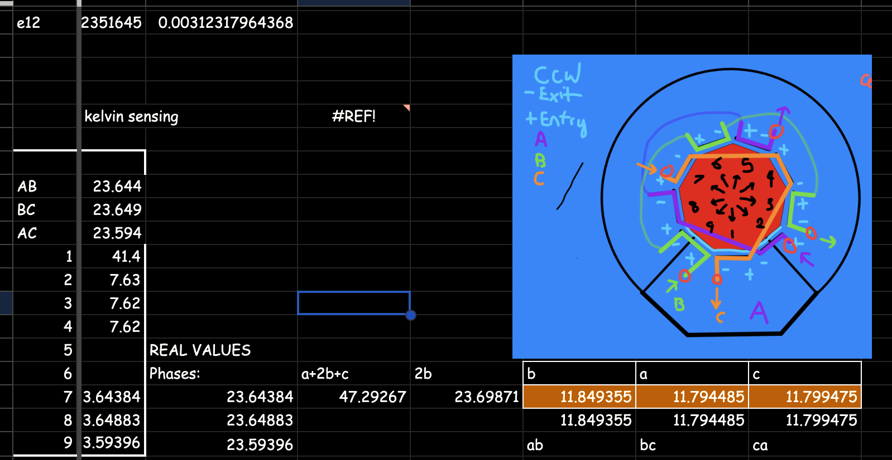

Next, I estimated my motor phase inductances. I felt it would be necessary to determine my switching speed, as if the time constant of my winding was even close to the on or off period of my high-side motor switching, I would not be able to maintain or build analog phase currents.

Since I didn't have an LCR meter, I researched ways to measure inductances without one. Here was my solution:
<!-- consider usingng footnotes to cite osurces -->
1.  Design a voltage controlled current source and class A amplifier using 2N222 BJT transistors
2. input a pseudo-sinusoidal wave form using ESP32's Digital to Analog Converter at the highest frequency possible.
3. Measure the voltage across 2 phases
 - since the pseudo AC signal's frequency was *very* small, I measured voltage across 2 phases at a time
4. repeat, but measure the current this time
5. calculate impedance, and use it to determine the inductor's reactance (since the phase resistances were already known)
 <!-- Aaron’s Damer transistors playlist, as well as the node-analysis methods from 6.002 lectures by Anant Agarwhal.   -->
This was the circuit schematic for my voltage AC-source.  

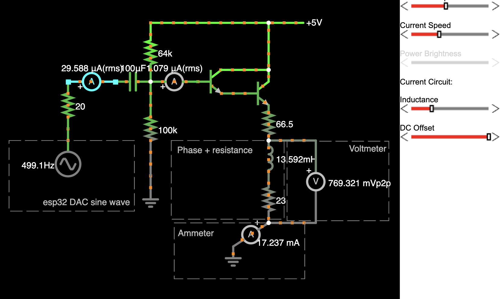

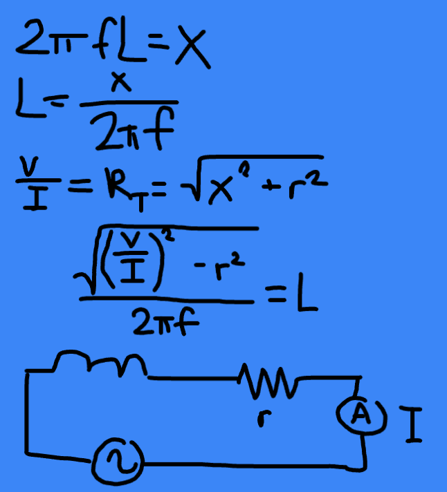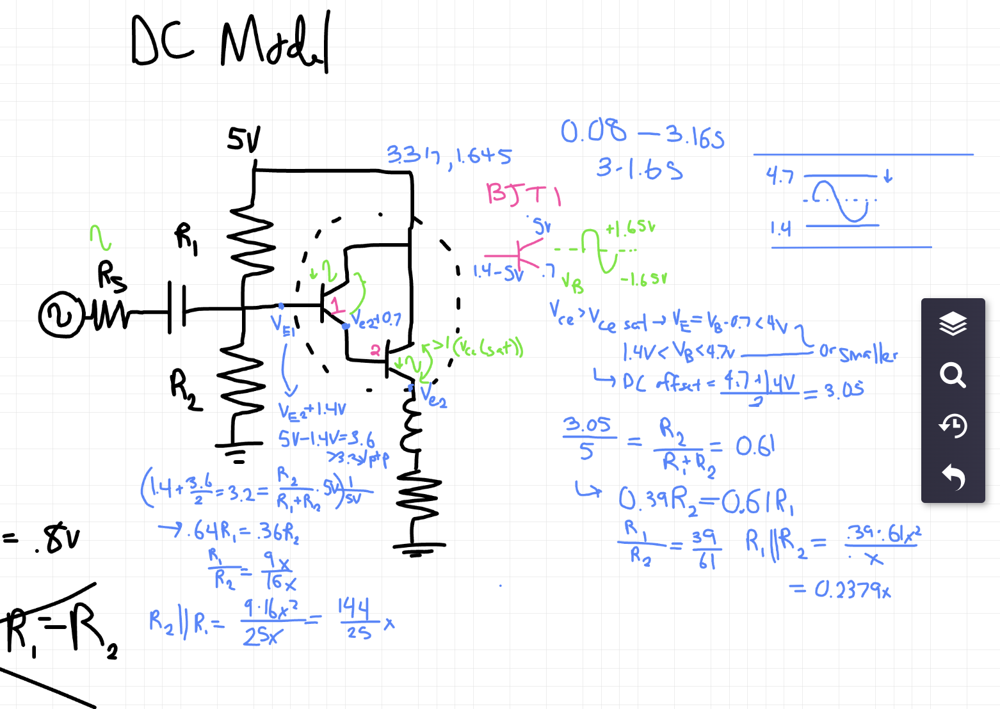

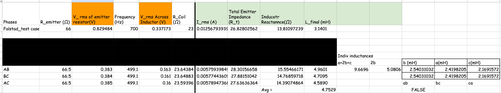

Finally, I modeled my motor phases using these values in a Falstad sub-circuit, and then on my breadboard.

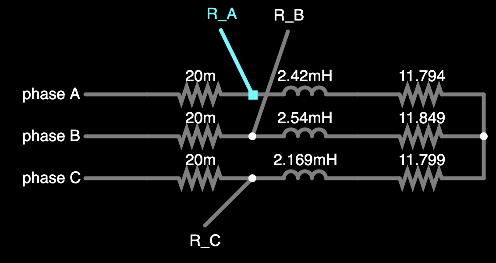 
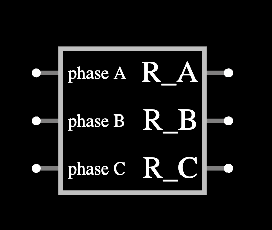

After I build ESC v0 (see [ESC V0 (A Breadboard Prototype)](#esc-v0-a-breadboard-prototype)), testing indicated my motor was unacceptably weak (D-). Granted, I was running it 7V lower than the planned operation. Regardless, I aimed to boost it, much, much higher.

Research and regents physics taught me that the magnetic field of a round solenoid scaled with current and copper winding density (B = µ₀*N* I/ℓ).
 Design constraints limited me to a non-ferromagnetic core (and instead 3D filament like PETG), and it wouldn't be an efficient use of time to rebuild. Besides, my motor coils can only expand inward (to obey the motor size constraint), which would reduce my rotor radius (and therefore, torque)

There doesn't exist a world where my windings can be called circular, but *if* there was one, I could only afford to raise my current
Since my motor casing was practically finalized then, I did. By Ohms law, I would achieve it by raising my motor bus voltage to around 24V. Consequently, at stall, motor current would peak at around 24V/ 22 ≈ 1A (for 2 active phases). I was worried about the overheating my motor, so I'll limit the current to 800mA continuous at normal operation.

Using ChatGPT as a calculator, I this would leave my motor at 57℃ in 3 minutes 20 seconds, a bit longer than the average FRC match with time to spare.
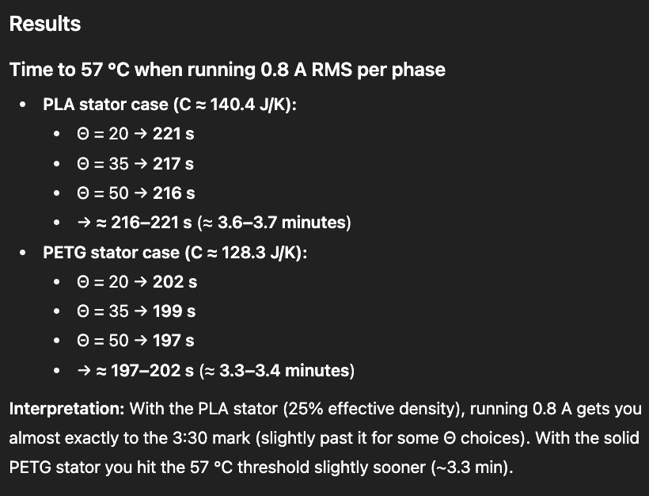

# Designing the Electronic Speed Controller(s)
## ESC V0 (A Breadboard Prototype)
This my final breadboard prototype circuit schematic. The main difference between this and my intended PCB design are the bootstrap circuits for my high-side MOSFET, which acted in place of MOSFET gate drivers. I built this circuit, ran it, and reached motor speeds of 800+rpm using 6-step commutation. 

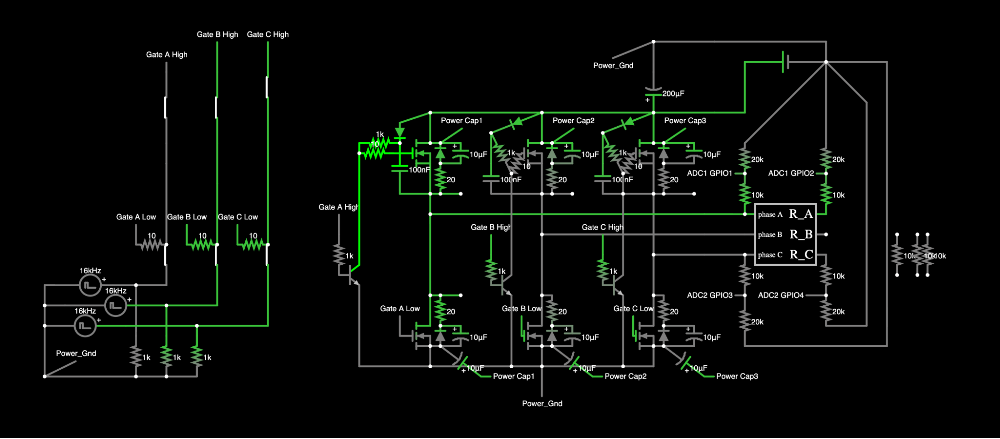  
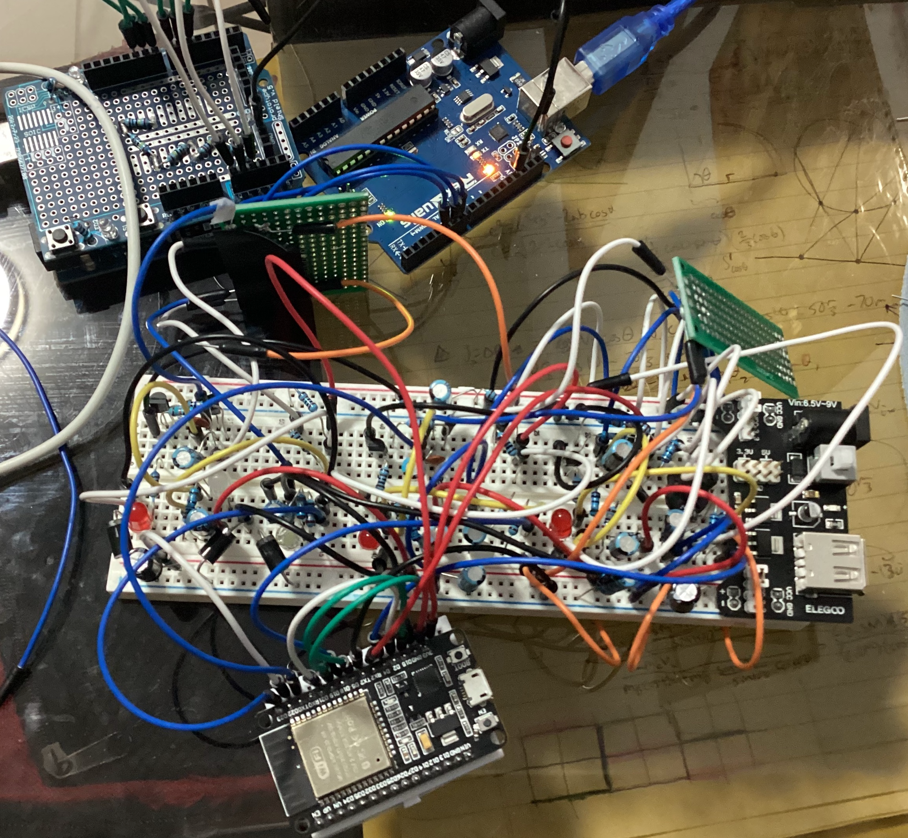  

 In this test video of [Stalls_on_touch](https://drive.google.com/file/d/1jOZRRTtnkDmA1HEMrV3pi_TpqVxhTH0C/view?usp=sharing), the motor spins to its maximum speed of around 600RPM, until the commutation was too fast for the rotor to keep up towards the last few seconds (There was no sensor feedback code implemented yet; in fact the motor didn't have a sensor at all)
- [Same Video here](/electrical/README_images/ESC_v0_falstad/breadboard_esc_joystick.mov)
<!-- img 0140 -->

## ESC V1
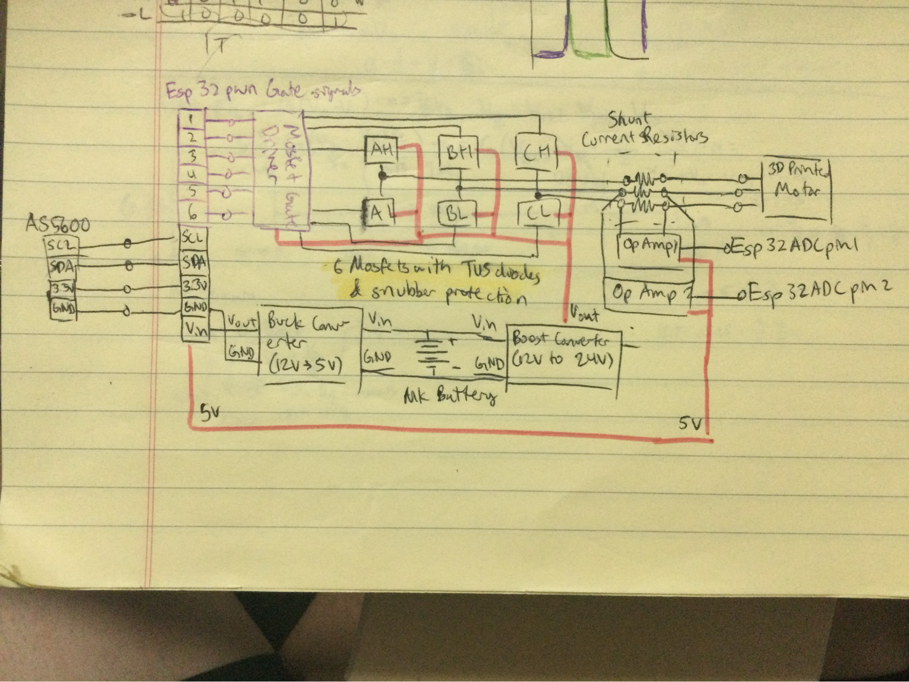

My motor controller uses:
- 3 half-bridge configuration, one half-bridge for each phase
  - I scrapped parts from FRC motor controllers (specifically Spark maxes), to salvage PSMN1R0-30YLD enhancement-mode MOSFETs 
- Shunt current sense resistors in-line with motor phases paired with current sense amplifiers (CSAs) for current feedback 
  - Kirchhoff's Current Law will determine the current in the third phase
- A power bus derived from the output of my buck-boost converter, converting 12V battery input and producing 24V
- A buck-converter supplying 5V voltage, which connected to Vin of my ESP-32 development board.
  - The onboard Low Dropout Regulator (LDO) will convert 5V to 3.3V
  - 3.3V is used for I2C and sensor operation and potentiometer for analog signal to esp32 pins
- the input of a AS5600 magnetic encoder communicating through I2C. 
- PTC resettable fuses capable of carrying 700mA each before tripping

<!--=========================== COLLAPSIBE SECTION ===========================-->
<!--=========================== COLLAPSIBE SECTION ===========================-->

   
 <h3><strong> Attempting to create Boost converter w/ feedback Control Loop</strong></h1> 

    <!-- NEED BROKEN LINE HERE -->
    I wanted to design my own boost and buck converter module as well, after being inspired from watching MIT’s Open Courseware 6.022 Power electronics series; however, I struggled to implement a feedback system for a stable output voltage.  
    Show below is my basic 555 astable implementation for a boost converter:  
    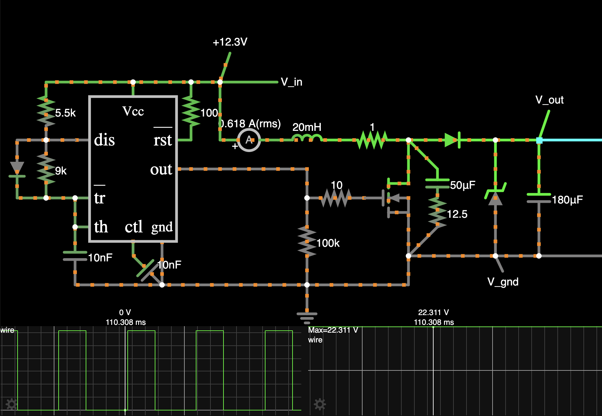
     
    My thought process was this: a logic or feedback system could be made either by programming a microcontroller to take input and give output, or it could automatically be regulated by hardware. I didn’t want to use multiple microcontrollers, and I thought creating feedback systems with hardware was more elegant than programming, so I attempted to manipulate the voltage of the CTRL pin on the 555 timer (used in an astable output configuration). the core Integrated chip(IC) that provided the necessary switching logic. I first attempted to look for a mathematical relationship between the duty cycle and the CTRL pin voltage.  
    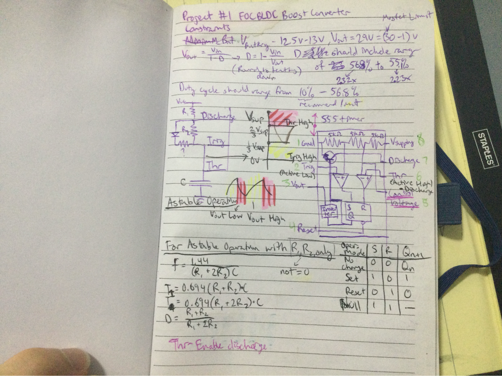
    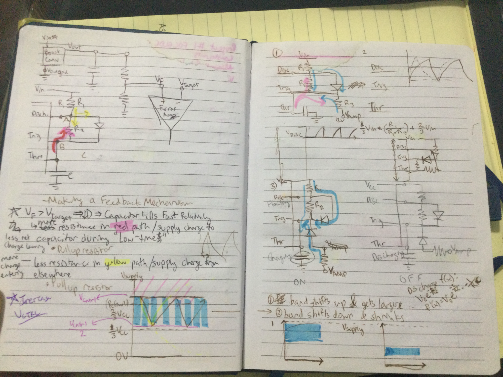
    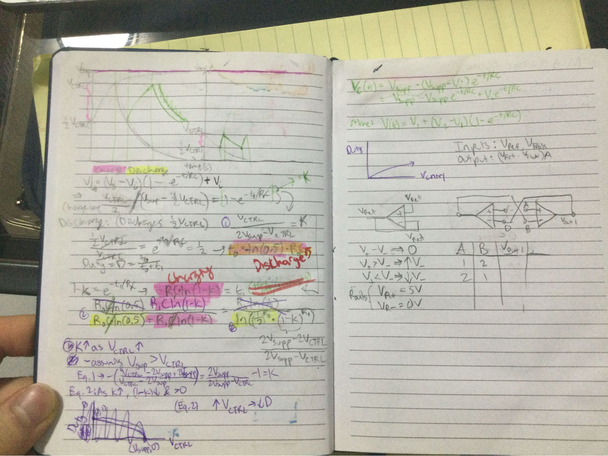
     
    Graphing showed me a direct (almost linear) relationship between the duty cycle and , which I hoped I could utilize through some feedback network.   
    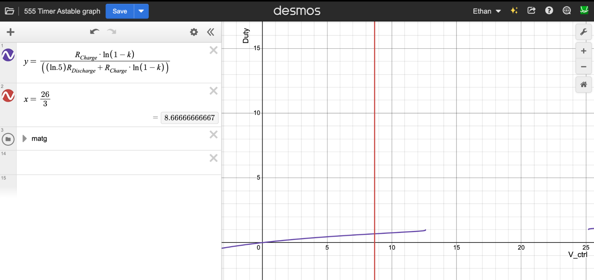
     
    So, I tried a 2 stage-implementation of my solution. The vertical switch would be closed, and the horizontal one would be open. Stage one has an Op-Amp with unity gain to act as a buffer (switch open in the circuit) so I drew negligible current from the voltage divider (which brought down the voltage to a ratio I hoped to keep constant). Stage 2 compared the output of the buffer to a potentiometer, which I would use to adjust the setpoint voltage.
    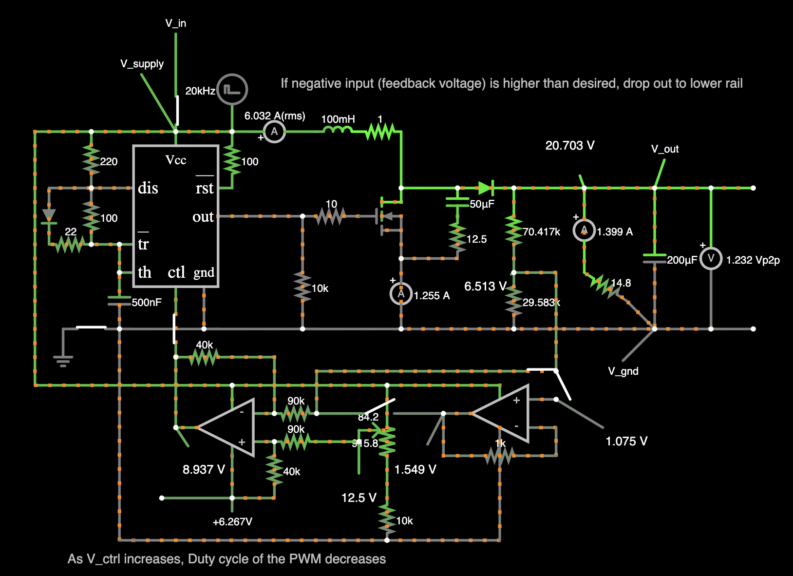
     
    However, it had many problems. Falstad showed that the circuit didn’t work as I predicted: adjustments would often change the 555 switching duty cycle and switching frequency. I spent multiple days attempting to solve this problem, but I realized if I continued, my project’s pacing would be slow. The time I spent on designing motor cases reminded me that I needed to get a prototype soon, and fail fast. So I decided to buy the converters online, and book this sub-project for a future investigation.

<!--=========================== COLLAPSIBE SECTION ===========================-->
<!--=========================== COLLAPSIBE SECTION ===========================-->

## First Time Designing with EasyEDA
<!-- From watching motor control algorithms, such as Field-Oriented Control (FOC) by Texas Instruments and also Janteen Lee’s series on FOC,  -->
<!-- While most modern BLDC motors run with 20kHz PWM frequency, I chose to use 16kHz because: 1) it was barely within my audio hearing range, and 2) I wanted to use ESP32’s ADC to read the measurements. For my first PCB, I’ve decided to sample with the ADC at 16kHz as well, so that I my measurements are always timed with the gate switching Using 16kHz allows me to attempt higher sampling frequencies in the future, such as 64kHz across 2 channels, totaling to 128kHz, which was about the limit of Espressif’s recommended ESP32 ADC reading speed. -->

After testing my ESC_V0, both on Falstad Simulation and on a breadboard, I recreated the schematic on EasyEDA, this time only with more suitable components. 
Watching a lot of PCB advice layout tutorials really scared me into thinking that at the speeds my controller is operating at, every parasitic effect was at 100% employment-- everything possible noise source was out to get me and ruin my PCB. Moreover, I heard cautionary tales of how routing in all layers could ruin PCBs and return currents, and displacement currents. There were big boy words I didn't fully understand yet, so I stuck to some basic rules for my first PCB:
1. Route signals and nets on top and bottom layers only (L1 and L4), with ground in the inner 2 planes
2. Use components the size of 0603 and bigger wherever possible for easy soldering
3. Add a couple of mils to all EasyEDA Design Rules to be on the extra safe side
4. No via in pads
5. Use the ESP32_Development kit
6. Use COTS Buck and Boost Converter
7. Use protection devices like Transient Voltage Suppressor (TVS) Diodes, snubber circuits, and fuses where possible.
8. Use the Nexperia's psmn1r0-30yld N-channel enhancement MOSFET that I scavenged from Spark maxes, because it would show that I knew what the scrapped component is used for.

 I have settled on a preferred component placement to minimize inductance and cross-talk across signals on my PCB. Below are the footprints as well as a 3D-model rendition of my current part placement.  
 

This layout was my first idea of a layout. Some might call me a genius for this one.

Three seconds into wiring routing my traces, I realized <!-- after placing 100% of the compoennets t -->my CSA outputs were 1.5", all while being surrounded by EMI-emitting switching components. It was the equivalent of routing the trace through a war zone. I had to redo my layout and prioritize the trace, ending up with this new layout below:

<!-- IMAGES   -->
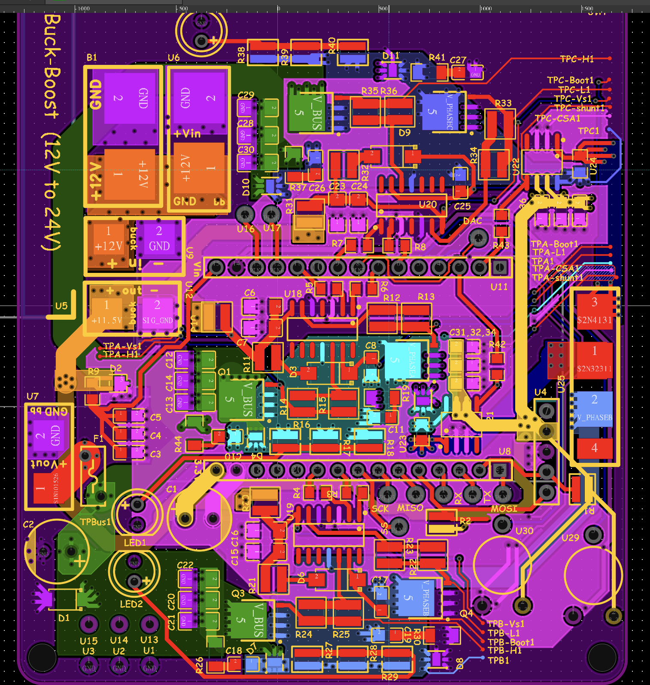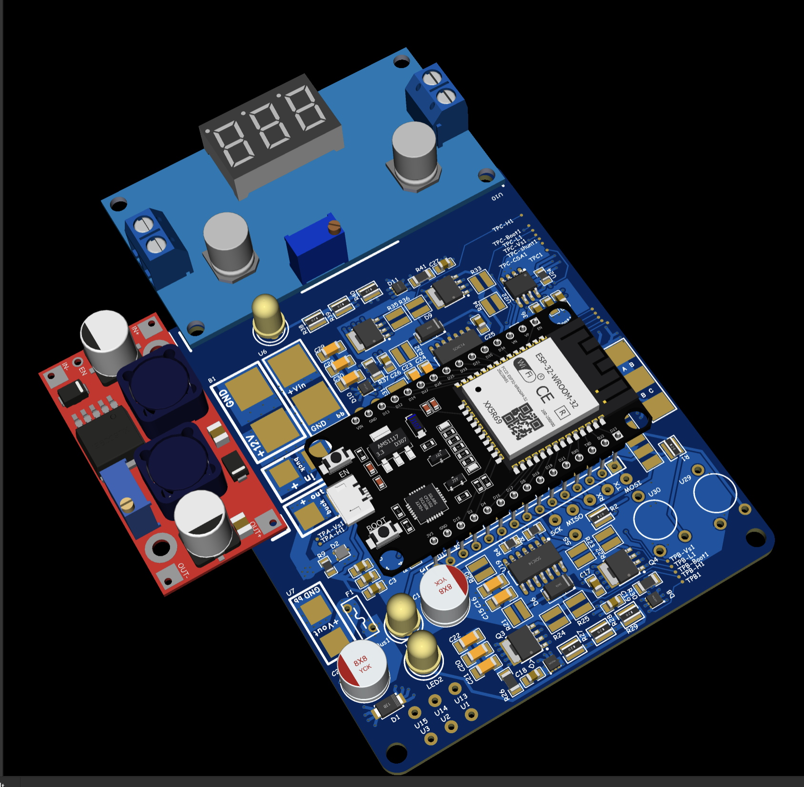

In all honesty, I had a lot of fun laying out both the ESC_v0 and v1 PCBs. Squeezing every mil of space available and conencting traces was like playing an upgraded versiono of the app Flow Free. Besides, the color scheme was very pretty. 

I chose to use JLCPCB's JLCO4161H-3313 stack-up, because the prepreg between layers L1 and L2, as well as L3 and L4, was 1/10 mm. which increases the capacitance between those layers and reduces loop inductance. At this point, I didn't really understand why it helped, but it was recommended, so I did it anyway. After visually checking the Gerber file, ensuring I had as big of traces as possible and as many vias as I could reasonably fit, I sent it off for it to be manufactured by JLCPCB.

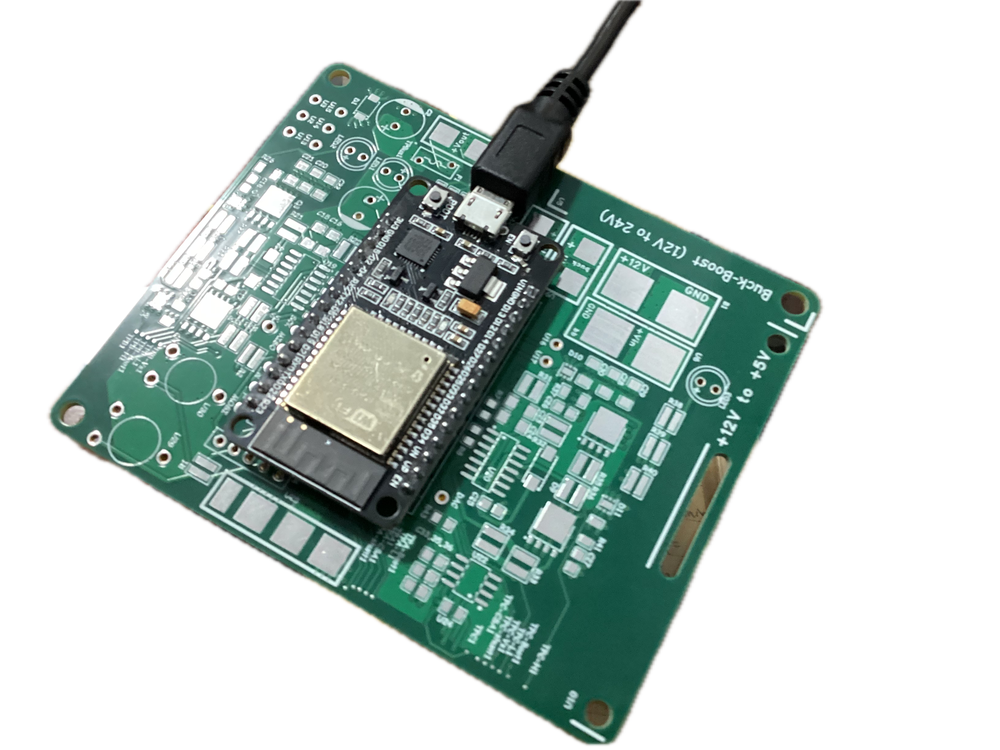

Using a soldering iron, at 250°C, I soldered all components except for the TVS2200DRVR, the surge protection diodes, came in a 6-pin WSON (DRV) footprint (2mm x 2mm), which was imposible ot solder with the soldering iron. I had to purchase a hot air rework station to solder it. 

When I was conducting preliminary tests with voltmeters, I realized I made a mistake on my schematic. The 11.5V net, which I used as the gate driver MOSFET gate drive voltage, was mistakenly connected to the output of the buck converter, meaning the voltage at my ESP32 development board Vin pin was 11.5V, near the upper limit of the LDO's maximum ratings. 

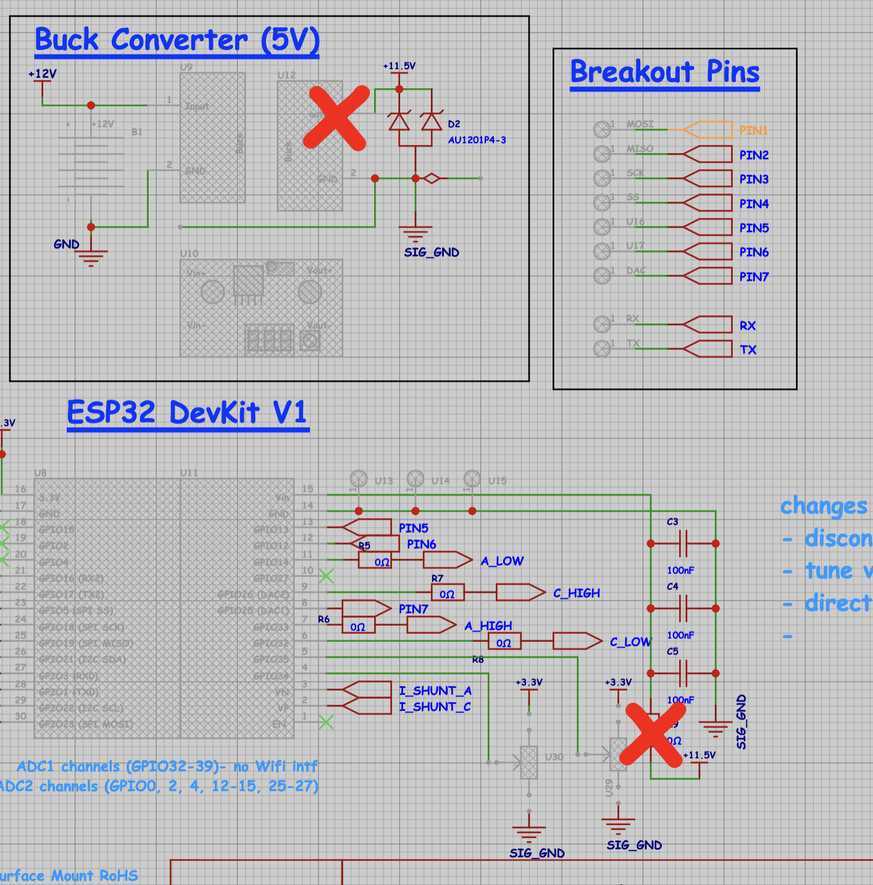

Luckily, I had spammed a lot of 0Ω jumper resistors, so I was able to disconnect nets and rewire them with 18AWG wires, as shown below.

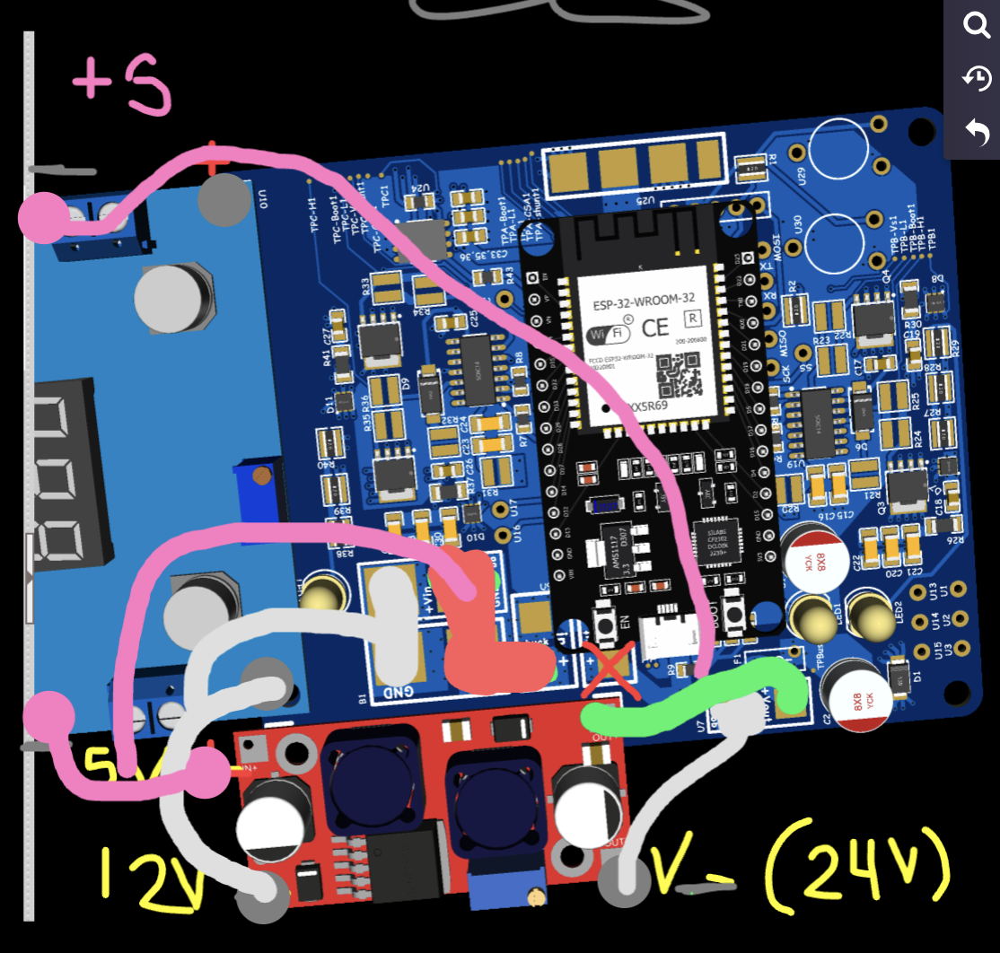

### Issues with ESC_V1
By the time I tested and successfully ran my 6 Block commutation code on my ESC V1 setup, I had found many issues with my current board, including:
1.  The stall torque at 20V, although much better than my v0 breadboard prototype, wasn't strong enough for me. It took a little effort, but I could easily overwhelm the motor and spin it in the opposite direction
2.  The TVS diode, as well as the MOSFETS, were simply intrinsically weak. I chose the TVS2200DRVR because it has the highest reverse standoff voltage while having a peak clamp at 28V, which was barely under the 30V drain-source maximum rating of the scrapped MOSFETs, but it could only stand up to 22V to 23V without activating all the time. I even burned a TVS diode once by setting the power bus voltage to 24V for a mere 5 seconds.
       - As I figured out, motors like the REV Neo v1.1 (which the Spark Max was designed for) used less resistive windings and a larger diameter/cross--sectional area wire for their motor windings. As such, they attained larger currents in return for a lower turn density and bus voltage. 
       - My motor had a relatively high winding resistance, but a higher turn density, so theoretically, if I had the same 
3.  The PCB, along with the side buck and buck-boost converter attachments, took up too much space. 
4.  The board was ugly
5.  I was thinking about making a motor controller that looked like a Spark Max, and fund the idea very appealing. However, this PCB wasn't anything
6. I learned how the ESP32 Analog to Digital Converter (ADC) wasn't perfect - the center of its linear range was at around 1.35V, instead of the 3.3V/2 = 1.65V that I assumed. That means that ESC V1 wasn't maximally utilizing the ADC, and achieving the most accurate signals
   
   - On another note, I used a shunt resistor of 25mΩ inline/ in series with the motor phases. At a stall current of 1A and with my CSA's gain of 50, the ESP32's ADC shunt voltage pins would experience voltage fluctuation of:
     - gain* Voltage = gain* (Current * resistance) = 50 * ±1A *25mΩ = ±1.25V
     - ⇒ 1.65V±1.25V = 1.4V to 2.9V
   - However, if I were to use 12 Block commutation, where one phase supplies current and the other 2 sink it, the voltage fluctuation would be:
     - gain* Voltage = gain* (Current * resistance) = 50 * ±4/3 A *25mΩ = ±1.66V
     - ⇒ 1.65V±1.66V = 0.99V to 3.31V, which is most definitely in the non-linear range of the ADC
7. The Spain potentiometer and the knob became very irritating to use for no reason

As a result, I decided to make a new iteration of the motor controller: ***ESC_v2***
<!-- 7. inser -->

## ESC V2
The issues presented were resolved in their corresponding bullets point below:
1. Upgrade the power bus voltage to 30V.
2. Choose more resilient TVS diodes and MOSFETs by selecting for 50V+ Maximum V_DS
   - I chose SP60N13GDP8, a 2-MOSFET-in-1 package with a maximum V_DS of 60V
   - The complementary TVS diode was the CJSMBJ36A, which starts clamping at a 44V breakdown voltage, and clamps voltage spikes to 57.5V
3.  

Changelog:
- using DFMs
- USB differential pair
- equal length tuning
- same ground and lots of suture vias