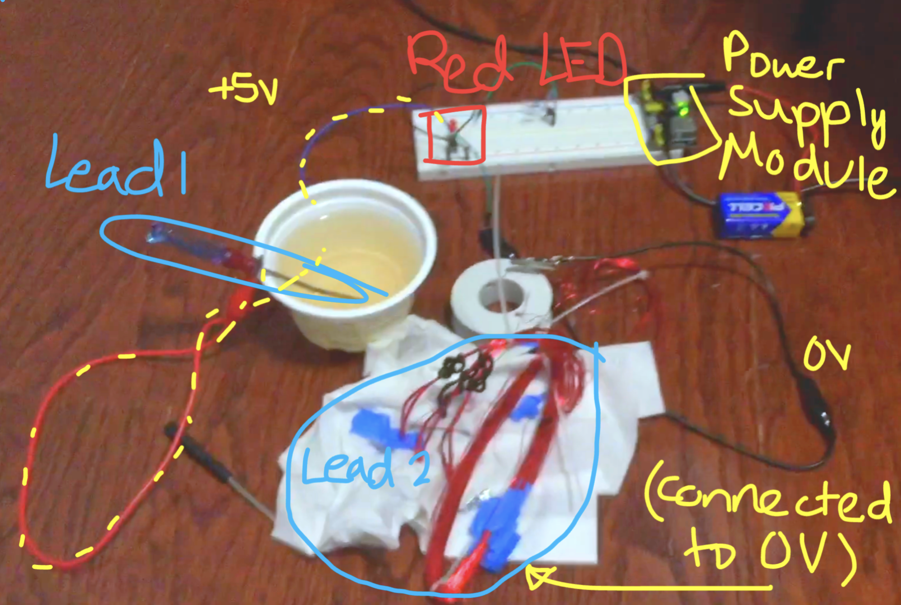
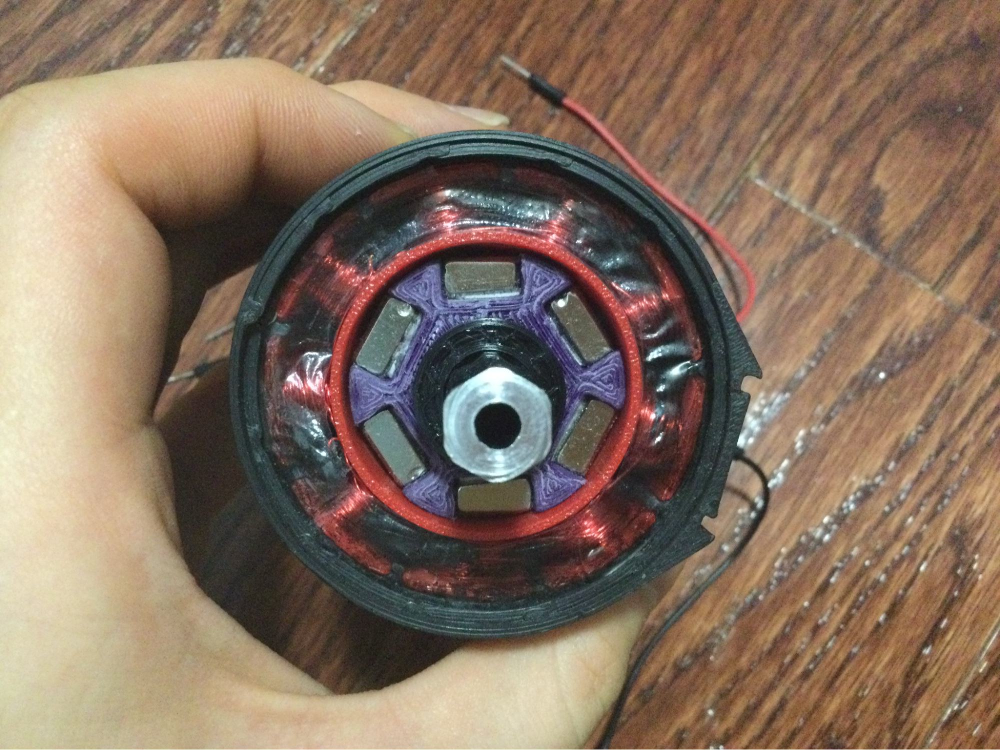

# Designing the Motor Casing
To create my motor, I first had to model the shape using Onshape. 
Besides the motor casing's size and shape restriction, the major limiting factor was my magnets 

 That involves:

* A 28 gauge enameled copper wire from BingoTech  
* 10mmx5mmx40mm N52 grade magnets  
* 3D printed parts (from the NYC First Stem Center)  
* Parts from the ELEGOO Arduino Starter Kit  
* and many more. While I tried my best to make my part as close as possible to real motor (in size and shape), there were certain limitations that forced me to bend the rules a little- I didn't have a spline XS shaft, nor could I have manufactured one (I couldn't find any scrap Kraken X60's either), so I replaced it with a 1/2" hex shaft.

<!-- >Google Sheets (which I use to do most of the electronic calculations): https://docs.google.com/spreadsheets/d/1zoV-iSvWJgggNpqaQPVjK8pLd_YnIrjemZmvVzTJ-E0/edit?usp=sharing.    
>    -->
Onshape CAD model: https://cad.onshape.com/documents/441ee0228635d6e7f63cc692/w/1e3ba592a198b8a0d94a5698/e/7b7b7b2b2a7df3ccfb7c86bf

As per the Dunning-Kruger effect, I originally thought this was going to be an easy project-as seen in the images below (I underestimate wire space and how much I needed, tolerance, wiring, and magnet size).  
I initially started out with an out-runner rotor design because I wanted to maximize the number of magnets I can put inside, thinking that it will increase my motor torque. That clearly wasn't right.  

^^(version 3 and version 4)

* You can see that after I printed this version and tested it, I realized that a measly 300mA and few strands of wire wasn't going to provide enough magnetic force to attract the rotor. I decided to make slots in the next version so I could put in steel or iron to increase core strength.

^^(version 7_1 and version 7_3)

* I was going to fill the gaps with ferromagnetic metal, but I didn't have any solid or strongly ferromagnetic pieces on hand. Somehow I thought the mandrels of steel rivets that the STEM center provided would do magic, so inside this version of the stator, I created large slots for the mandrels in the stator case. But, after running 200mA of current through a test coil wound around each stator slot, it still didn’t have a strong attraction to the N52 magnets, despite how I pack as many turns of wire around the slot as I could per phase. If the core material barely helped, my best bet was to  redesign the stator to maximize the amount of wires that I can loop around.

* After a while, I settled on using the AS5600 magnetic sensor for FOC feedback. However, I hadn't designed my motor with this piece in mind, and I realized I had to do another redesign. The bigger problem was that packaging was going to get challenging on another level, and I was already pushing the thinness of the PETG stator to the limits. Ultimately I switched to an in runner rotor design. Ironically, later on through accidental research, I would discover that the Kraken x60 itself is an out runner motor. However, since only external appearance and functionality mattered to me, I continued my project.

  

After printing many case designs, v27 is my current one.

For each major stator iteration, I wrapped as much wire as I could fit per-phase on each stator slot, and “shorted” both ends to the Arduino kit’s 5V Power board module, providing around 200mA current, and testing the magnetic force. It was through this testing that I realized that I underestimated the space that the phase coils took up. I ended up pushing the limit on the smallest stator thickness, with my final print being 2-3 walls thick.

## Assembly

Because I chose a very small wire diameter, I had to compensate with a larger length, and so I needed around 170 feet for each phase. This meant wiring would be more tedious, error prone, and time consuming. I 3D printed a jig to measure 1 foot, and simply wrapped the 28 gauge wire along it, measuring around 165 turns, and carefully removing it.

Making scratches to the enamel was inevitable, despite my caution. To prevent phases from shorting with itself, I wrapped electrical tape over exposed copper (the windings won't reach the point of melting the tape). I also used a saltwater pinhole test to find less visible scratches for some phases   

I faced smaller issues with tolerance and fitting, as I attempted to squeeze every millimeter of space between the rotor magnets and stator so I could magnify the magnetic force when coils were activated. I had sanded down both the rotor and stator until the rolling friction of the bearing and drag were the only sources of friction.

This was the interior of the final product after months of design and 3D printing. The red PETG stator, chosen for its higher temperature resistance than PLA, held the windings, and the magnets were attached onto the rotor by pressfitting and with the double sided tape that came with the magnets I bought.  

left to right: V1, v3, v4, v7_3, v18, v26, current motor  

